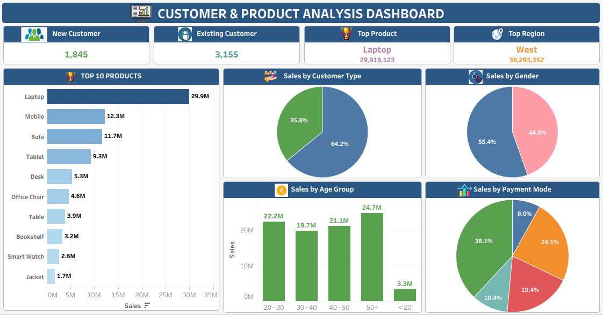
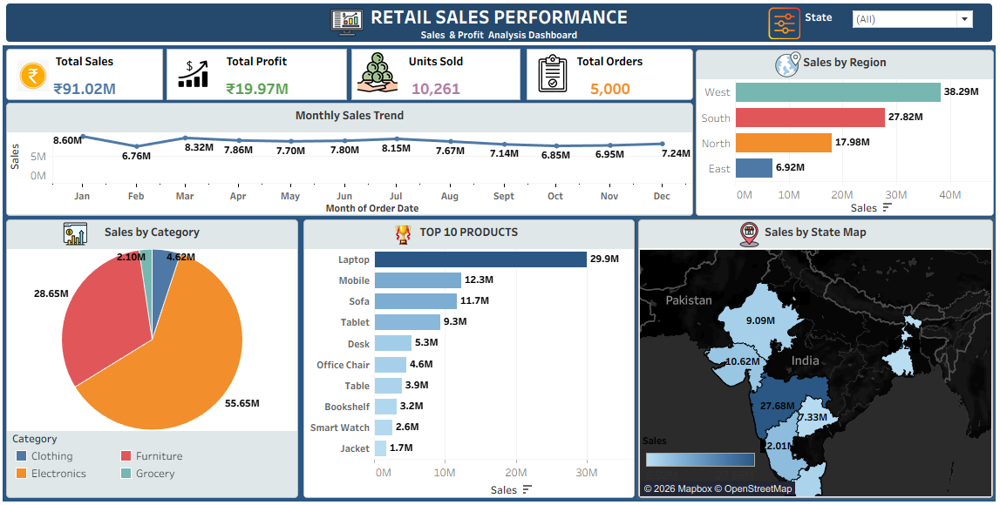

# 📊 Retail Sales Analysis & Interactive Tableau Dashboards

## 📌 Project Overview

An interactive Retail Sales Analytics project developed using **Tableau** to analyze sales performance, customer behavior, product performance, profitability, regional performance, and state-wise sales across India.

The project contains **two interactive dashboards** designed to provide business-focused insights through KPIs, charts, filters, and geographical visualization.

---

## 🎯 Project Objectives

- Analyze overall retail sales performance
- Monitor total sales, profit, units sold, and orders
- Identify new and existing customers
- Identify top-performing products
- Analyze sales by customer type and gender
- Analyze sales by age group and payment mode
- Track monthly sales trends
- Analyze category-wise and region-wise sales
- Visualize state-wise sales across India
- Support data-driven business decision making

---

# 📊 Dashboard 1 — Customer & Product Analysis

### Key Features

- New Customer Analysis
- Existing Customer Analysis
- Top Product
- Top Region
- Top 10 Products
- Sales by Customer Type
- Sales by Gender
- Sales by Age Group
- Sales by Payment Mode

### Key Results

| Metric | Result |
|---|---:|
| New Customers | 1,845 |
| Existing Customers | 3,155 |
| Top Product | Laptop |
| Top Product Sales | ₹29.92M |
| Top Region | West |
| West Region Sales | ₹38.29M |

### Dashboard Preview

---

# 📈 Dashboard 2 — Retail Sales Performance

### Key Performance Indicators

| KPI | Value |
|---|---:|
| Total Sales | ₹91.02M |
| Total Profit | ₹19.97M |
| Units Sold | 10,261 |
| Total Orders | 5,000 |

### Dashboard Features

- Total Sales KPI
- Total Profit KPI
- Units Sold KPI
- Total Orders KPI
- Monthly Sales Trend
- Sales by Category
- Sales by Region
- Top 10 Products
- Sales by State Map
- Interactive State Filter

### Dashboard Preview

---

## 🏆 Top 10 Products

Sales performance was analyzed to identify the highest-performing products.

1. Laptop
2. Mobile
3. Sofa
4. Tablet
5. Desk
6. Office Chair
7. Table
8. Bookshelf
9. Smart Watch
10. Jacket

---

## 🌍 Regional Sales Analysis

The dashboard provides a comparison of sales across four major regions:

- West
- South
- North
- East

The **West region** is the highest-performing region based on sales.

---

## 🗺️ State-wise Sales Analysis

An interactive India map was created to visualize sales performance across different states.

This helps identify:

- High-performing states
- Low-performing states
- Regional sales distribution
- Geographic sales opportunities

---

## 🛠️ Tools & Technologies

- Tableau
- Microsoft Excel
- Data Visualization
- Business Intelligence
- Dashboard Development
- KPI Analysis
- Data Analysis

---

## 📊 Analytical Skills Demonstrated

- Data Cleaning
- Data Analysis
- KPI Development
- Interactive Dashboard Design
- Sales Analysis
- Customer Segmentation
- Product Analysis
- Geographic Analysis
- Trend Analysis
- Business Insights

---

## 🔗 Tableau Public

View the interactive dashboards on Tableau Public:

[View Retail Sales Performance Dashboard on Tableau Public](https://public.tableau.com/app/profile/vaibhav.kamble7351/viz/Final_Project_Retail_Sales_Data/DASHBOARD_RETAIL_SALES_PERFORMANCE)

---

## 📂 Project Files

- `Retail_Sales_Analysis_Dashboard.twbx` — Tableau packaged workbook
- `Dashboard_Customer_&_Product_Analysis.png` — Customer & Product Analysis dashboard
- `Dashboard_Retail_Sales_Performance.png` — Retail Sales Performance dashboard

---

## 💡 Business Insights

This project provides insights into:

1. Overall sales and profitability
2. New vs existing customer contribution
3. Top-performing products
4. Regional sales performance
5. Category-wise sales contribution
6. Customer gender analysis
7. Age-group sales behavior
8. Payment mode preferences
9. Monthly sales trends
10. State-wise sales distribution

---

## 👨‍💻 Author

**Vaibhav Kamble**

Data Analytics | Tableau | Power BI | Excel | SQL

---

⭐ If you find this project useful, feel free to explore the dashboard and provide feedback.
