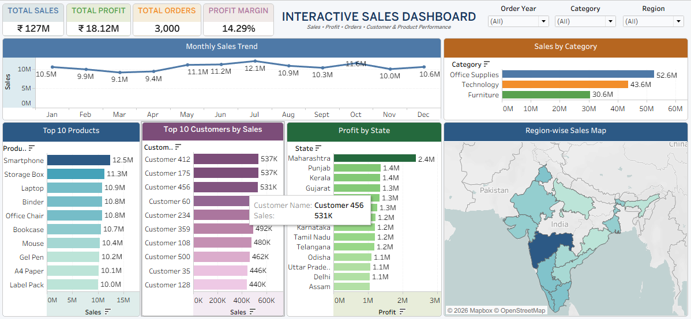

# 📊 Interactive Sales Dashboard — Tableau

## Project Overview

An interactive Sales Dashboard developed using Tableau to analyze sales, profit, orders, customer performance, product performance, and state-wise sales across India.

## 🎯 Project Objectives

- Analyze overall sales and profit performance
- Monitor total orders and profit margin
- Identify top-performing products and customers
- Analyze sales by category
- Analyze state-wise profit
- Track monthly sales trends
- Visualize sales across Indian states
- Enable interactive business analysis

## 🛠️ Tools Used

- Tableau
- Microsoft Excel
- Data Visualization
- Business Intelligence

## 📌 Dashboard Features

- KPI Cards
- Monthly Sales Trend
- Sales by Category
- Top 10 Products
- Top 10 Customers
- Profit by State
- India Sales Map
- Year Filter
- Category Filter
- Region Filter
- Dashboard Actions

## 📊 Key KPIs

| KPI | Value |
|---|---:|
| Total Sales | ₹127M |
| Total Profit | ₹18.12M |
| Total Orders | 3,000 |
| Profit Margin | 14.29% |

## 🖼️ Dashboard Preview

## 🔗 Tableau Public

View the interactive dashboard:

[View Interactive Sales Dashboard on Tableau Public](https://public.tableau.com/views/Project_INDIAN_STORE/InteractiveSalesDashboard?:showVizHome=no)

## 📈 Business Insights

The dashboard helps identify:

1. Overall sales performance
2. Overall profitability
3. Monthly sales trends
4. Category-wise sales contribution
5. Top-performing products
6. Top customers by sales
7. State-wise profit performance
8. Low-profit or loss-making states
9. Regional sales distribution
10. Key areas for business decision-making

## 📂 Project Files

- `Interactive_Sales_Dashboard.twbx` — Tableau packaged workbook
- `Interactive_Sales_Dashboard.png` — Dashboard screenshot

## 👨‍💻 Author

**Vaibhav Kamble**

Data Analytics | Tableau | Power BI | Excel | SQL
